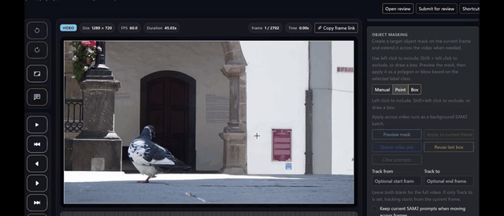
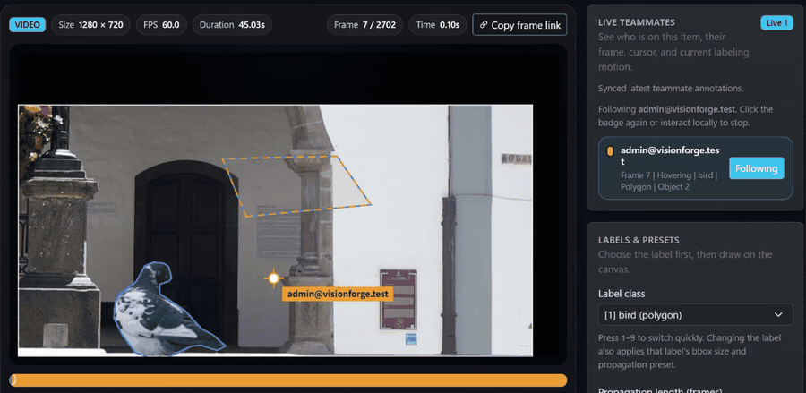

# VisionForge Community Edition

Self-hosted, video-first annotation for edge AI teams.

Release history and highlights live in [CHANGELOG.md](CHANGELOG.md).

## SAM2 object masking demo

This inline GIF previews prompt-based object masking with SAM2 and batch
propagation across a video clip directly on the GitHub page.



Need a higher-quality copy? Download the
[MP4 demo](docs/media/object-masking-sam2-demo.mp4).

The repository keeps lightweight README-safe derivatives in `docs/media/`
instead of the original full-resolution capture so clones stay small.

## Live collaboration labeling demo

This side-by-side demo shows two teammates labeling the same video item. One
annotator traces and adjusts a bird polygon while the other teammate sees live
presence and the in-progress polygon update in real time.



Need a higher-quality copy? Download the
[MP4 collaboration demo](docs/media/live-collaboration-labeling-demo.mp4).

## Choose a runtime profile first

VisionForge Community Edition now ships with three public deployment profiles:

| Profile | Best for | Default SAM2 mode | Env template |
| --- | --- | --- | --- |
| `gpu` | Primary local development profile on an NVIDIA GPU workstation | enabled | `.env.gpu.example` |
| `cpu` | Fallback local development profile on a CPU-only machine | disabled | `.env.cpu.example` |
| `cloud` | Single-host self-hosting | disabled | `.env.cloud.example` |

Windows uses the same flow through `manage_vision_forge.bat`.
`restart` ensures the database is running, applies migrations when enabled, and then recreates the API container.

## Quick start

### 1. Pick an env template

```bash
cp .env.gpu.example .env
```

Available templates:

- `.env.cpu.example`
- `.env.gpu.example`
- `.env.cloud.example`

`.env.example` now mirrors the GPU local-development default.

### 2. Set the required secrets

At minimum, replace:

- `SECRET_KEY`

For cloud/self-hosting, also replace:

- `LF_DATABASE_PASSWORD`
- `DATABASE_URL`

If you are upgrading from an older deployment that still stores legacy
SHA-256 password hashes, also keep `PASSWORD_SALT` set to the previous salt
value until those accounts have signed in or reset their passwords.

If browsers will access the API from a different origin, also set:

- `CORS_ALLOW_ORIGINS`

For HTTPS or reverse-proxy deployments, review:

- `SESSION_COOKIE_HTTPS_ONLY`
- `SESSION_COOKIE_SAME_SITE`
- `TRUST_PROXY_HEADERS`
- `TRUSTED_PROXY_IPS`

### 3. Start the stack

```bash
./manage_vision_forge.sh up-build
```

On Windows:

```bat
manage_vision_forge.bat up-build
```

The management scripts now:

- select the compose overlay from `LF_RUNTIME_PROFILE`
- use `.env` as the main configuration source
- run `alembic upgrade head` after startup by default

Recommended rule:

- switch profiles by copying the matching `.env.*.example` file to `.env`
- treat CLI profile overrides as a troubleshooting shortcut, not the normal workflow

### 4. Sign in with the bootstrap admin account

The local-development templates (`.env.example`, `.env.gpu.example`,
`.env.cpu.example`) enable a bootstrap system admin account for local
evaluation:

- Email: `admin@visionforge.test`
- Password: `VisionForge123`

On startup VisionForge ensures this account exists and resets its password to
the value currently configured in `.env`. The login page only surfaces these
repository-default credentials for local or loopback access.

`.env.cloud.example` keeps bootstrap admin disabled by default. On a fresh
self-hosted install, temporarily set:

- `BOOTSTRAP_DEFAULT_ADMIN_ENABLED=1`
- `BOOTSTRAP_DEFAULT_ADMIN_EMAIL=<your-admin-email>`
- `BOOTSTRAP_DEFAULT_ADMIN_PASSWORD=<unique-password>`

Sign in once, then disable the bootstrap account again and restart the app.

Before sharing the instance with other users or deploying it outside local
evaluation, change these values or disable the bootstrap account through:

- `BOOTSTRAP_DEFAULT_ADMIN_ENABLED`
- `BOOTSTRAP_DEFAULT_ADMIN_EMAIL`
- `BOOTSTRAP_DEFAULT_ADMIN_PASSWORD`

Legacy aliases remain available:

- `dev -> gpu`
- `stg -> cloud`
- `prod -> cloud`

The canonical compose layout for public onboarding, documentation, and CI is:

- `infra/compose.base.yaml`
- `infra/compose.cpu.yaml`
- `infra/compose.gpu.yaml`
- `infra/compose.cloud.yaml`

## Runtime layout

The public Community Edition moved away from the old `dev / stg / prod` naming
for the primary onboarding path.

Why:

- `dev / stg / prod` describes deployment stage
- `cpu / gpu / cloud` describes how someone can actually launch the app

For public adopters, the second question comes first.

## Hardware And Config Options

Use this mental model:

- `gpu` is the default developer path
- `cpu` is the fallback when a contributor does not have CUDA access
- `cloud` is the single-host deployment path

Important storage note:

- the current public Community Edition does not yet ship an S3/object-storage backend
- all three profiles currently store uploaded media on the local/container filesystem
- `cloud` differs by persisting uploads through a Docker volume instead of a source bind mount

Video labeling conversion note:

- video labeling now prepares a browser-played converted video once and reuses it for frame stepping and playback
- conversion is controlled with `LABELING_PROXY_ENABLED`, `LABELING_PROXY_CRF`, `LABELING_PROXY_PRESET`, `LABELING_PROXY_MAX_WIDTH`, `LABELING_PROXY_GOP_SIZE`, `LABELING_PROXY_B_FRAMES`, `LABELING_PROXY_MAX_CONCURRENT_JOBS`, `LABELING_PROXY_STORAGE_BUDGET_GB`, and `LABELING_PROXY_STORAGE_TTL_DAYS`
- the default public profile keeps full resolution and uses a short GOP converted video so image quality is prioritized while frame stepping stays responsive
- the items page now shows the local converted-video storage budget, current usage, and host free space so operators can see when automatic cleanup may kick in
- when the configured converted-video budget is exceeded, the least recently opened conversions are evicted first; conversions idle past the TTL are also removed automatically and regenerated on next access
- variable-frame-rate videos are rejected at upload time because frame-accurate labeling currently requires constant frame rate (CFR)
- this avoids backend RAM frame caches while keeping the annotation UI on a single browser `<video>` timeline

See:

- `docs/deployment_profiles.md`
- `docs/configuration_options.md`
- `docs/database_migrations.md`
- `docs/community_edition_scope.md`

## Dependency management

Pinned runtime dependencies now live in:

- `requirements/base.txt`
- `requirements/cpu.txt`
- `requirements/gpu.txt`

The Docker image build uses those requirement sets directly, so the repository
has an explicit dependency contract instead of relying on ad-hoc installation in
the Dockerfile.

## Database migrations

Alembic is now the official schema migration path.

Run migrations directly with:

```bash
./manage_vision_forge.sh migrate
```

The app still keeps its runtime schema compatibility checks in `app/main.py` as
a safety net for older internal databases and disposable local environments, but
new schema work should go through Alembic revisions.

## Repository scope

This repository contains the public Community Edition of VisionForge.

It includes:

- first-party Community Edition application code
- first-party templates and UI assets
- project-authored documentation and examples

It does not include:

- private enterprise modules
- OEM or redistribution rights
- commercial support deliverables
- customer data
- private model packages or private checkpoints

## Private overlay path

The Community Edition startup keeps a public core app factory in
`app/main.py`.

Private or enterprise overlays can attach additional middleware, mounts, or
routers through `APP_EXTENSION_HOOKS`, for example:

```bash
APP_EXTENSION_HOOKS=vision_forge_enterprise.app_hooks
```

Each configured module should expose `apply_extension_hooks(app)` so the
private repository can layer on top of the public core without forking the
startup flow.

## Licensing summary

- First-party Community Edition code in this repository is licensed under
  Business Source License 1.1
- Each public release has its own Change Date
- On the Change Date, that specific release changes to `AGPL-3.0-or-later`
- Third-party dependencies, models, checkpoints, fonts, and other upstream
  material keep their own original licenses
- Customer input data and exported annotation outputs are not relicensed by this
  repository

See:

- `LICENSE`
- `LICENSE.BSL-1.1`
- `COMMERCIAL_LICENSE.md`
- `THIRD_PARTY_NOTICES.md`
- `MODEL_LICENSES.md`

## Security note

Do not run cloud or production-style deployments with placeholder secrets.

Do not leave repository-default bootstrap admin credentials enabled outside
local or loopback evaluation.

Keep `SESSION_COOKIE_HTTPS_ONLY=1` for non-local deployments. If TLS terminates
at a reverse proxy, enable `TRUST_PROXY_HEADERS` only for proxy IPs you
explicitly trust through `TRUSTED_PROXY_IPS`.

Do not use wildcard browser origins. Set `CORS_ALLOW_ORIGINS` to an explicit
comma-separated allowlist when cross-origin browser access is required.

Do not publish private checkpoints, customer datasets, or customer exports in
this repository.

## Before public release

- confirm the Licensor name and licensing contact email remain current
- verify that `LICENSE` and `LICENSE.BSL-1.1` are distributed together
- verify third-party notices for the exact dependencies and model assets you
  actually distribute
- run `python tools/check_public_release.py`
- review the final license package with counsel before release
